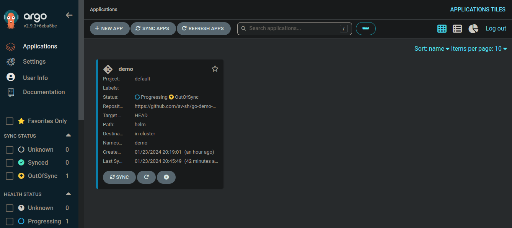
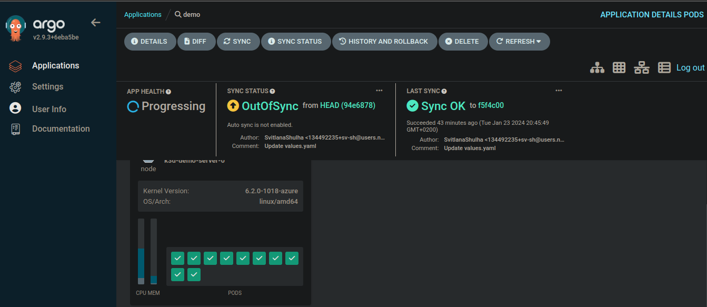
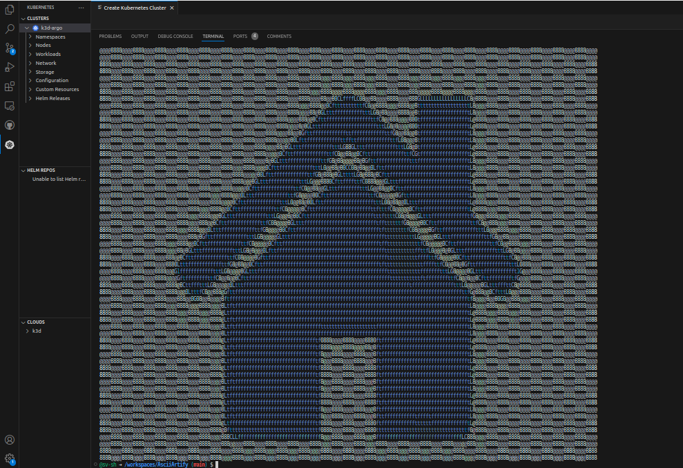

Task:
From the DevOps perspective, it is necessary to create an application in ArgoCD that will track the Git repository of the product at https://github.com/sv-sh/go-demo-app (fork from sours of the task) and configure automatic synchronization.

Implementation:

1.Creating the application from a public repository.

ArgoCD UI has been configured previously(POC.md), I will use it.
The repo link  contains helm chart for the deployment:

Press + NEW APP
Enter the application name as: demo
The project to which the application belongs is chosen by: default
Leave the synchronization type as: Manual

In the SOURCE section, leave the source type as GIT by default.
Repository URL that contains the deployment manifests: https://github.com/sv-sh/go-demo-app 
Revision: HEAD
Path : helm 

In DESTINATION section:
Cluster URL : https://kubernetes.default.svc
Namespace: demo 

After this, ArgoCD will automatically determine the application parameters using the manifests found in the repository. If you wish to change the values manually, you can modify them in the PARAMETERS section.

Then we tick the checkbox: AUTO-CREATE NAMESPACE, so Argo will create the new namespace in order to be synchronized with the repository properly (helm no longer has this function)

Click 'create'

2.Application Sync.
Click 'synchronize',view changes and details:

All changes in repo affect the app, we can see it  after changing the value in the helm chart:
https://github.com/sv-sh/go-demo-app/blob/master/helm/values.yaml
from NodePort to LoadBalancer (service type), and commit changes ( NodePort will be reverted after the test.)

$ NAME               TYPE           CLUSTER-IP      EXTERNAL-IP   PORT(S)             AGE
ambassador         LoadBalancer   10.43.190.212   <pending>     80:30092/TCP          35m

3. Test the application.

kubectl port-forward -n demo svc/ambassador 8088:80

Open a new terminal window and first curl the ambassador service to view the version

curl localhost:8088

Upload a random image, save it locally, and  use again curl to use it as a payload:

wget -O /desired/path/.png <image-link>
curl -F 'image=@/specified/path.png' localhost:8088/img/

wget -O ./temp/pic.png https://blog.hubspot.com/hs-fs/hubfs/how-to-make-picture-into-link_4-1.webp?width=595&height=400&name=how-to-make-picture-into-link_4-1.webp

curl -F 'image=@./tmp.png' localhost:8088/img/

4. Clean.

Remove cluster and docker containers:

k3d cluster delete demo
docker images
docker rmi <listed container IDs>

